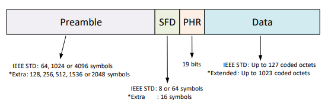
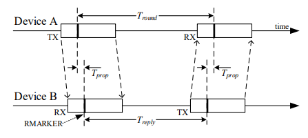
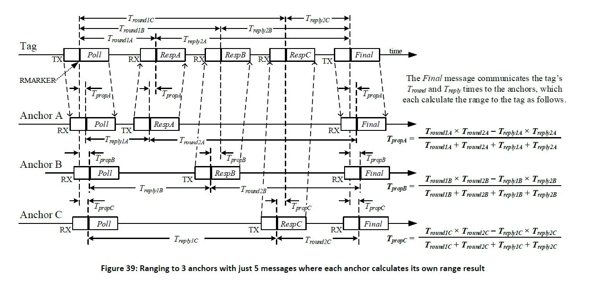
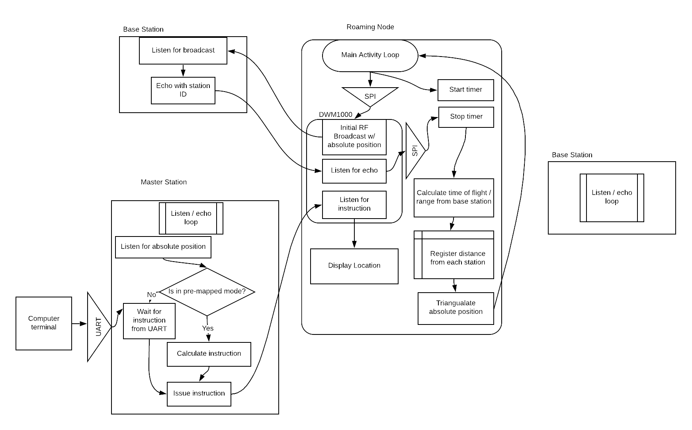
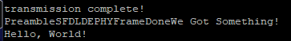
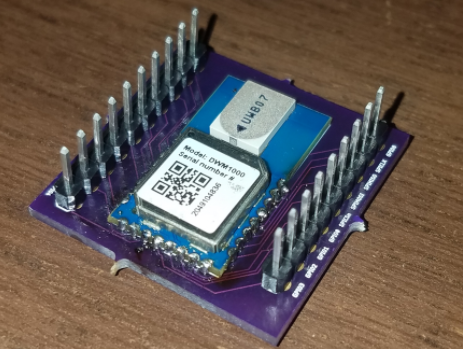

# Two-Way Ranging on the STM32 DISCOVERY
  - [Initial Proposal](#initial-proposal)
    - [Proposed Purpose](#proposed-purpose)
    - [Proposed Milestones](#proposed-milestones)
      - [Milestone 1:](#milestone-1)
      - [Milestone 2:](#milestone-2)
      - [Milestone 3:](#milestone-3)
      - [Milestone 4:](#milestone-4)
  - [Revised Proposal](#revised-proposal)
    - [Revised Purpose](#revised-purpose)
    - [Revised Milestones](#revised-milestones)
      - [Milestone 1:](#milestone-1-1)
      - [Milestone 2:](#milestone-2-1)
      - [Milestone 3:](#milestone-3-1)
      - [Milestone 4:](#milestone-4-1)
  - [Process Explanations](#process-explanations)
    - [SPI (Revised Milestone 1)](#spi-revised-milestone-1)
    - [Cross Chip Communication (Revised Milestone 2)](#cross-chip-communication-revised-milestone-2)
    - [Two-Way Ranging (Revised Milestone 3)](#two-way-ranging-revised-milestone-3)
    - [3 Station Calculations (Revised Milestone 4)](#3-station-calculations-revised-milestone-4)
    - [High Level Block Diagram](#high-level-block-diagram)
  - [Lab Concepts Used](#lab-concepts-used)
  - [Milestones Achieved](#milestones-achieved)
  - [Major Road Blocks](#major-road-blocks)
    - [SPI](#spi)
    - [Cross Chip Communication](#cross-chip-communication)
  - [Setup](#setup)
  - [Required Materials](#required-materials)
    - [Pin Connection Lists](#pin-connection-lists)
      - [SP1](#sp1)
      - [SP2](#sp2)
      - [UART](#uart)

## Initial Proposal
### Proposed Purpose
This project calculates the location of devices in 3D space. The STM32 will drive the main event loop and use a DWM 1000 module to send and time the full travel time of an ultra wide band signals to base stations containing the same module and back. At the end of the project, a base station will be repurposed to allow commands to be sent back to the RC car.

### Proposed Milestones
#### Milestone 1: 
Demonstrate two-way ranging between a moving device and a base station. Some rudimentary UART interface will be used to display current distance between the two devices.

#### Milestone 2: 
Demonstrate 3D triangulation by using 4 base stations. After triangulation has been completed, the found position is displayed on the rudimentary UART interface.

#### Milestone 3: 
Demonstrate autonomous navigation by feeding the found position to the demonstration car. Car navigates to known positions.

#### Milestone 4: 
Demonstrate fully working project. Communication to the master station allows car status to be displayed to a computer, and the computer can issue commands.

## Revised Proposal
### Revised Purpose
This project calculates the location of devices in 2D space. The STM32 will drive the main event loop and use a DWM 1000 module to send and time the full travel time of an ultra wide band signals to base stations containing the same module and back. At the end of the project, 2D triangulation will be achieved by using 3 base stations and one roaming station. After triangulation has been completed, the found position is displayed on the rudimentary UART interface.

### Revised Milestones
#### Milestone 1: 
Use the SPI communication protocol to communicate with the DWM 1000 chips.

#### Milestone 2: 
Use SPI to command two DWM 1000 chips to send and receive messages to/from each other

#### Milestone 3: 
Demonstrate two-way ranging between a moving device and a base station. Some rudimentary UART interface will be used to display current distance between the two devices.

#### Milestone 4: 
Demonstrate 2D triangulation by using 3 base stations and one roaming station. After triangulation has been completed, the found position is displayed on the rudimentary UART interface.

## Process Explanations
### SPI (Revised Milestone 1)
SPI allows synchronous, serial communication between the MCU and external devices.  Application software can manage the communication by polling the status flag or using dedicated SPI interrupt.

Four I/O pins are dedicated to SPI communication with external devices.
• MISO: Master In / Slave Out data. This pin is used to transmit data in slave mode and receive data in master mode.
• MOSI: Master Out / Slave In data. This pin is used to transmit data in master mode and receive data in slave mode.
• SCK: Serial Clock output pin for SPI masters .
• NSS: Slave select pin. This is being used to slave select on a negative trigger

### Cross Chip Communication (Revised Milestone 2)
For the cross chip communication as explained previously, a simple "Hello, World!" message was transmitted from one chip to the other. The format of a transmission frame on a DWM 1000 chip is as follows: 

The reception of a frame is enabled by a host request or by an automatic re-enabling of the receiver. The receiver will search for preamble continually until preamble has been detected or acquired, then a demodulation will be attempted.

### Two-Way Ranging (Revised Milestone 3)
Single-sided two-way ranging (SS-TWR) involves a simple measurement of the round trip delay of a single message from one node to another and a response sent back to the original node as shown in the figure below: 

The operation of SS-TWR is as shown in the figure above, where device A initiates the exchange and device B responds to complete the exchange and each device precisely timestamps the transmission and reception times of the message frames, and so can calculate times *T*_round and *T*_reply by simple subtraction

### 3 Station Calculations (Revised Milestone 4)
This is where the roaming station ranges to three fixed anchors. Each anchor then calculates the distance to the tag. These three distances are then combined in an infrastructure-based solver to locate the tag. 

The roaming station sends a Poll message which is received by the three anchors in the infrastructure who reply in successive responses with packets RespA, RespB & RespC after which the tag sends the Final message received by all three anchors. This allows the tag to be located after sending only 2 messages and receiving 3 for a total of 5 messages.

### High Level Block Diagram

## Lab Concepts Used
This project uses a total of 5 labs, GPIO, Interrupts, Timers, UART, and instead of I2C we are using SPI.

## Milestones Achieved
From the original milestones only milestone 1 was achieved, as it turns out, getting SPI to work using our STM32 discovery's is no easy feat as explained below. Hours upon hours were spent trying to get this communication protocol to work. In hindsight we bit off significantly more then we could chew. Milestone 3 and 4 on the proposed milestones were significantly out of range for this "Mini" project in the time and instruction we had for this class.

## Major Road Blocks
### SPI
The SPI communication protocol as mentioned above was extremely difficult. We tried all methods of getting it to work, we tried the HAL library first but had no luck getting the signals to actually send. After confirming our suspicions using an analog discovery 2, we decided to write the whole thing from scratch, which sadly also failed to work. As a last resort, we went back to HAL with a fresh slate and new pin assignments, finally after lots of trail and error we successfully got communication to the chips working! After tens of hours revised Milestone 1 was finally achieved.

### Cross Chip Communication
Initially there were lots of issues revolving around the chips talking to each other, when trying to send a simple "Hello, World!" string the results came across all garbled:

After determining the correct string transmission length and also the fact that the message had to be loaded in to the memory buffer backwards, the correct string was finally transmitted: 

Getting these chips to work required reading through the whole 200 page user manual for the DWM 1000 chips a few times, before finally being able to understand and implement how these unique chips work.

## Setup 
## Required Materials
* STM32-DISCO Board

* 2+ DWM 1000 Chips **

* Jumper Cables

* UART to USB Cable

**These chips have castellated edges, so you will either need a PCB for it or will need to solder wires directly to each edge (However this is very difficult and due to the pin pitch, and static sensitivity not recommended).

We decided to make a series of custom PCB's for this project: 

### Pin Connection Lists
There are two DWM 1000 chips connected to each STM32 board, therefore SPI 1, SPI 2, and UART are used on each STM32.

#### SP1
STM32 | DWM 1000
----- |--------
PB3 | SCLK
PB4 | MISO
PD5 | MOSI
PA4 | SSn
PC1 | IRQ (GPIO8)

#### SP2
STM32 | DWM 1000
----- |--------
PB13 | SCLK
PB14 | MISO
PB15 | MOSI
PB12 | SSn
PC2 | IRQ (GPIO8)

#### UART
STM32 | DWM 1000
----- |--------
PC4 | TX
PC5 | RX

